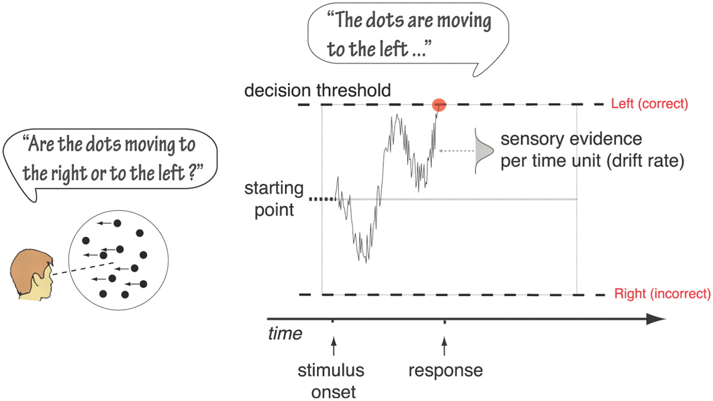
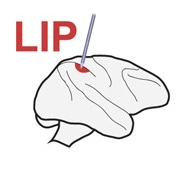
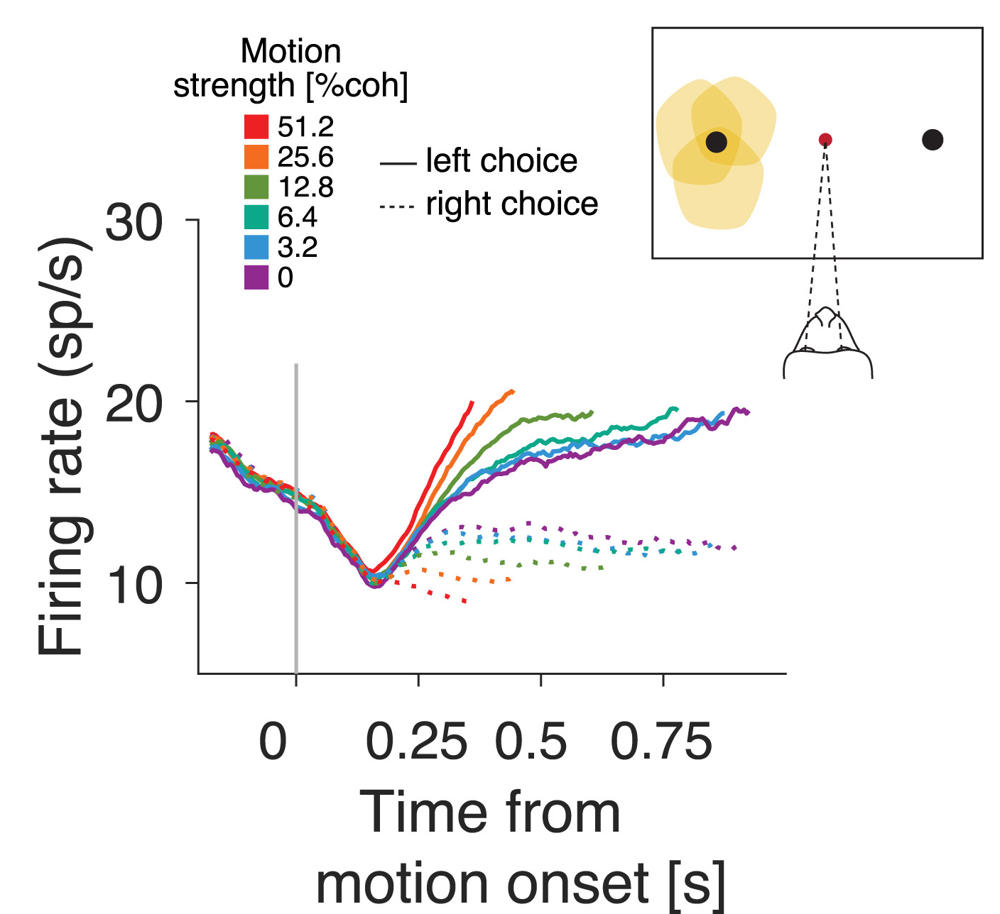
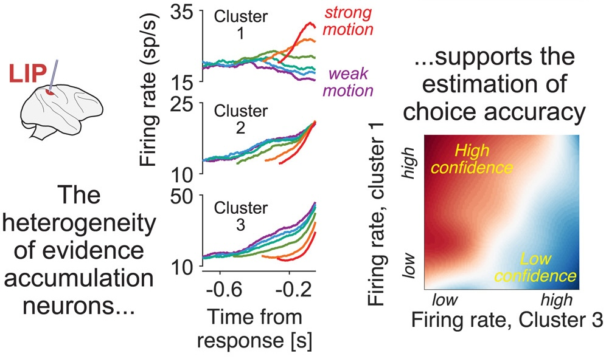
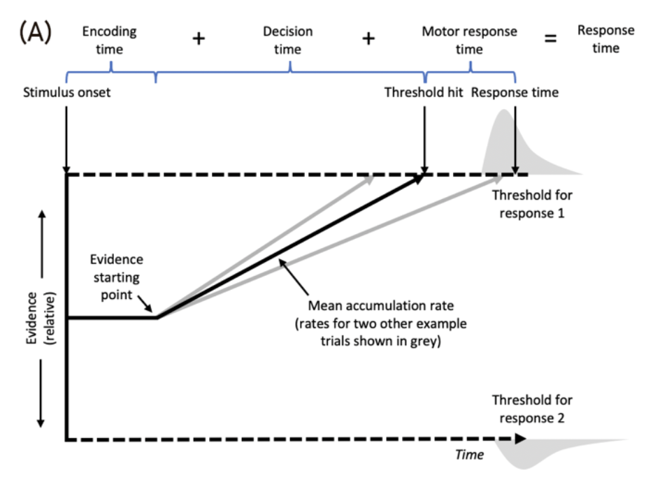
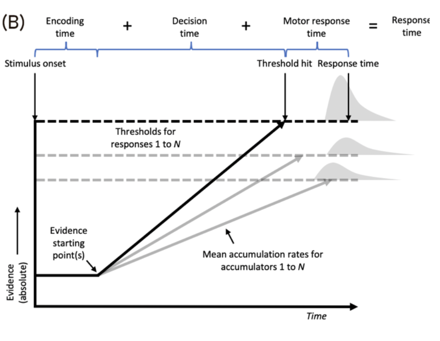
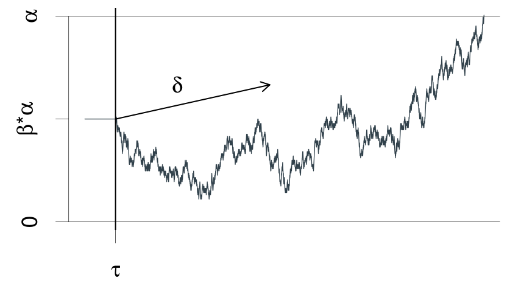
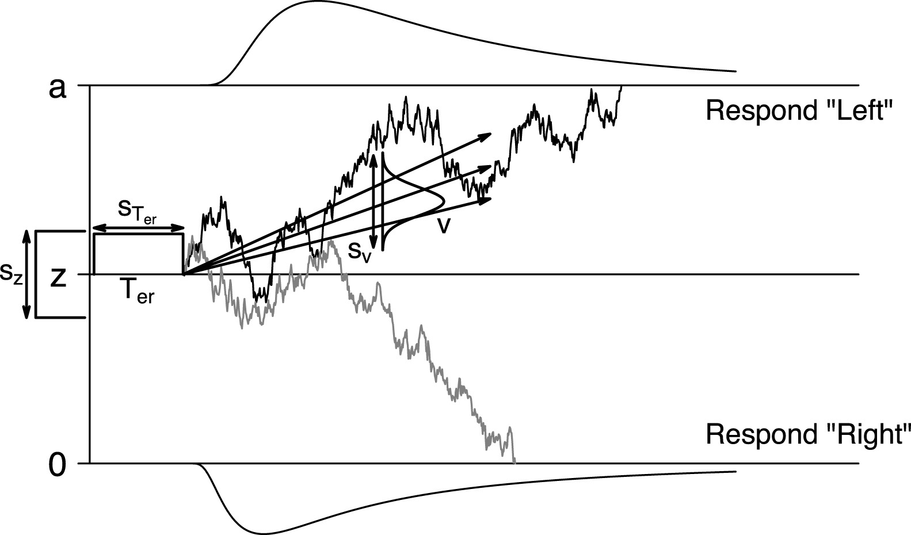
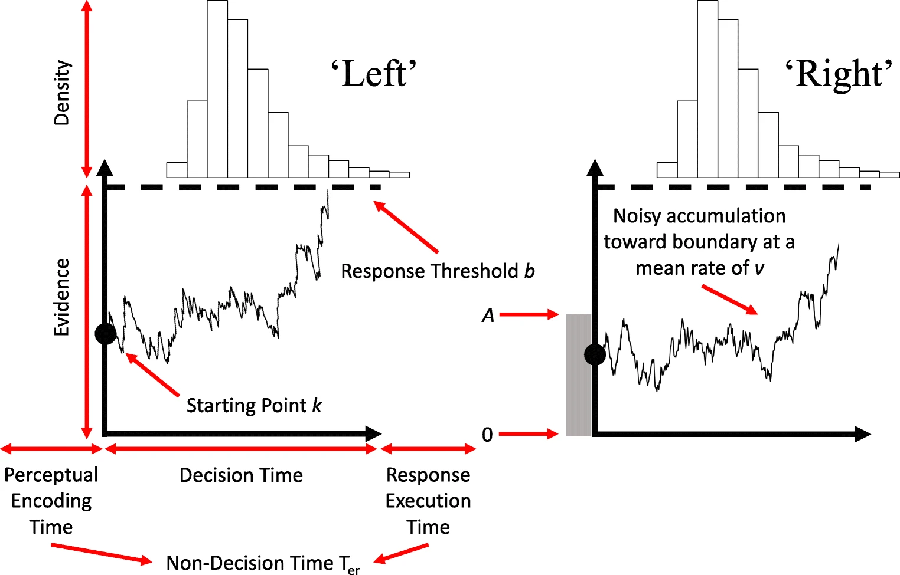

```{r}
#| echo: false
library(ggplot2)
library(dplyr)
```

## Perception into action {.small-text}

Evidence Accumulation Models assume that, upon stimulus presentation, the decision maker:

-   Samples noisy evidence for available options (e.g., "Should I press left or right?")
-   Accumulates that evidence until a **threshold** is crossed

::::: columns
::: {.column width="70%"}
{width="700" height="400"}
:::

::: {.column .small-small-text .center width="30%"}
<br/>

> [Mulder, M. J., Wagenmakers, E. J., Ratcliff, R., Boekel, W., & Forstmann, B. U. (2012). Bias in the brain: a diffusion model analysis of prior probability and potential payoff. Journal of Neuroscience, 32(7), 2335–2343.](https://doi.org/10.1523/JNEUROSCI.4156-11.2012){target="_blank"}
:::
:::::

## What is “evidence”?

Neural signals reflecting sensory or internal information relevant to a choice.

***"Are dots moving to the right or to the left?"***

-   Neurons fire in proportion to motion direction & strength.
-   These firing rates = **momentary evidence**.

# How does the brain accumulate evidence?

## 1. Sensory neurons encode momentary evidence

<br/>

-   Spiking in **sensory cortex** represents stimulus features.
-   Noisy and varies trial-to-trial.

## 2. Integrator neurons receive this input

::::: columns
::: {.column width="50%"}
<br/>

-   Neurons in **LIP**, **dlPFC**, or **striatum** ramp up/down over time.

-   Reflects **accumulated evidence**

{width="150" height="150\"" fig-align="center"} [Zylberberg & Shadlen, 2025](10.1016/j.celrep.2025.115526){.small-text target="_blank"}
:::

::: {.column width="50%"}
{width="600" height="800\""}
:::
:::::

::: notes
Neurons in the lateral intraparietal (LIP) area with response fields overlapping the choice-target contralateral to the recording site (Tin neurons) represent the accumulation of evidence in favor of contralateral target selection. The monkey reports its decision via a saccadic eye movement to one of the targets and is rewarded for correct choices. In trials where the monkey chooses the contralateral target (i.e., the one within the neurons’ response field), the Tin neurons represent the winning race, whereas on ipsilateral choices, they represent the losing race.
:::

## 3. Threshold crossing triggers a decision

<br/>

{width="800" height="900\"" fig-align="center"}

[Zylberberg & Shadlen, 2025](10.1016/j.celrep.2025.115526){.small-text target="_blank"}

<br/>

## Brain computation of decisions

<br/>

| Cognitive Term | Neural Interpretation                 |
|----------------|---------------------------------------|
| *Evidence*     | Sensory neuron firing rates           |
| *Accumulation* | Integration in parietal/frontal areas |
| *Noise*        | Trial-to-trial neural variability     |
| *Bound*        | Decision threshold in firing/activity |

## Sequential processing assumption

Total **Response Time (RT)** is modeled as the sum of **three sequential stages**:

1.  **Stimulus encoding**
2.  **Evidence accumulation** (decision-making)
3.  **Motor response execution**

Stages (1) and (3) are captured in the **nondecision time (Ter)** parameter.

::: notes
the models contain parameters controlling the evidence starJng point (allowing for a priori biases), accumulaJon rate (controlling the speed of processing), threshold/boundary separaJon (controlling the amount of evidence required to make a response), and nondecision Jme (the sum of Jme taken for sJmulus encoding and motor response production).
:::

# Latent Cognitive Parameters

##

EAMs decompose decisions into:

-   **Drift rate (v)**

-   **Threshold (a)**

-   **Bias (z)**

-   **Nondecision time (Ter)**

## Drift Rate (v)

-   Reflects **evidence strength**

-   ⬆ Drift → fast & accurate decisions

-   ⬇ Drift → slow, error-prone

Manipulated by:

-   Stimulus discriminability

-   Attention/task difficulty

## Thresholds (a)

-   Set before stimulus onset

-   Reflect **response caution/cognitive control/bias/preference**

⬆ Threshold:

-   Slower but more accurate

⬇ Threshold:

-   Faster but error-prone

> Manipulate via pre-trial cues or instructions.

## Starting Point (z)

-   Reflects **response bias**

-   Midpoint = no bias

Deviating from midpoint:

-   Favors one response:
    -   Faster/more accurate for favored
    -   Slower/less accurate for disfavored

Set **before** stimulus onset.

## Nondecision Time (Ter)

-   Time to encode stimulus + execute response

-   Shifts RT distribution **without** changing shape/accuracy

Sensitive to:

-   Visual complexity

-   Motor demands

> Hard to estimate precisely — often noisy across individuals.


## Relative Evidence Models {.small-text}

In **relative evidence models** (e.g., Wiener process, Diffusion Decision Model):

::::: columns
::: {.column width="40%"}
<br/>

-   Decision is based on the **difference** in accumulated evidence between two options.

<br/>

-   Suitable for **binary choices**.
:::

::: {.column width="60%"}
{.align-center width="550" height="350"}
:::
:::::

> [Boag, R. J., Innes, R. J., Stevenson, N., Bahg, G., Busemeyer, J. R., Cox, G. E., … Forstmann, B. (2024, July 2). An expert guide to planning experimental tasks for evidence accumulation modelling.](https://doi.org/10.31234/osf.io/snqgp){target="_blank"}

## Absolute Evidence Models {.small-text}

In **racing accumulator models** (e.g., LBA, RDM):

::::: columns
::: {.column width="40%"}
-   Each option has its own **accumulator** tracking **absolute evidence**.

-   Decision is made by the **first accumulator to reach threshold**.

-   Can handle **multiple alternatives** (not just binary choices).
:::

::: {.column .small-small-text .align-center width="60%"}
{width="550" height="350"}
:::
:::::

> [Boag, R. J., Innes, R. J., Stevenson, N., Bahg, G., Busemeyer, J. R., Cox, G. E., … Forstmann, B. (2024, July 2). An expert guide to planning experimental tasks for evidence accumulation modelling.](https://doi.org/10.31234/osf.io/snqgp){target="_blank"}

::: notes
Although relative and absolute evidence models differ in how they conceptualize evidence, they:

-   Share similar assumptions about trial structure and data quality
-   Use overlapping parameters (drift rate, threshold, bias, nondecision time)
-   Often reach the **same substantive conclusions**
-   Provide convergent results when applied to the same data
:::


## Wiener Process {.small-text .align-center}

The **Wiener process** (Brownian motion) is the foundation of many decision models [(Smith & Ratcliff, 2024)](https://doi.org/10.1007/978-3-031-45271-0_4){.small-small-text}. It models the accumulation of evidence as a noisy process:

<br/> $$
x(t) = z + vt + sW(t)
$$ <br/>

::::: columns
::: {.column width="40%"}
-   $x(t)$: accumulated evidence at time $t$
-   z: starting point
-   v: drift rate (signal strength)
-   s: noise (standard deviation of the increments)
-   $W(t)$: standard Wiener process (Gaussian increments)
:::

::: {.column width="60%"}
```{r}
#| echo: false
#| fig-asp: .6
#| out-width: 95%
#| fig-width: 7

set.seed(11)
path = function(drift, sp1=0,  noise_constant=1, dt=0.0001, max_rt=2) {
  max_tsteps = max_rt/dt
  
  # initialize the diffusion process
  tstep = 0
  x1 = sp1 # vector of accumulated evidence at t=tstep
  time = 0
  
  # start accumulating
  while (tstep < max_tsteps) {
    x1 = c(x1, x1[tstep+1] + rnorm(mean=drift*dt, sd=noise_constant*sqrt(dt), n=1))
    time = c(time, dt*tstep)
    tstep = tstep + 1
  }
  return (data.frame(time=time, x=x1, accumulator=rep(1, length(x1))))
}

drift = -0.5

sim_path = path(drift = drift)

ggplot(data = sim_path, aes(x = time, y = x))+
  geom_line(size = 1, color = "blue4") +
  theme_minimal()

```
:::
:::::


## Wiener First Passage Time (FPT) {.small-text .align-center}

> It is the expected distribution of the time until the process first hits or crosses one or the other boundary. This results in a bivariate distribution, over responses $x$ and hitting times $t$.

::::: columns
::: {.column width="50%"}

:::

::: {.column width="50%"}
-   $\alpha$ : threshold
-   $\beta$ : initial bias
-   $\delta$: quality of the stimulus (often $v$)
-   $\tau$: non-decision time
:::
:::::

[Navarro & Fuss, 2009](https://papers.djnavarro.net/2009_firstpassage.pdf){.small-small-text target="_blank"}[; Wabersich & Vandekerckhov, 2014. Copyright 2009, Joachim Vandekerckhove and Department of Psychology and Educational Sciences, University of Leuven, Belgium](https://journal.r-project.org/archive/2014/RJ-2014-005/index.html){.small-small-text target="_blank"}

## Full Diffusion Decision Model {.align-center}

<br/>

The **Full DDM** accounts for more behavioral phenomena by allowing **trial-to-trial variability** in key parameters:

<br/>

**Drift rate**: $v \sim \mathcal{N}(\mu_v, \eta^2)$

**Starting point**: $z \sim \text{Uniform}(z - s_z/2, z + s_z/2)$

**Non-decision time**: $t_0 \sim \text{Uniform}(t_0 - s_{t_0}/2, t_0 + s_{t_0}/2)$

## Full DDM Parameters {.small-text .align-center}

::::: columns
::: {.column .align-left width="40%"}
$a$: decision boundary

$z$: starting point

$v$: drift rate

$t_0$: non-decision time

$s$: noise scale (usually fixed to 1)

$\eta$: SD of drift rate across trials

$s_{z}$: variability in start point

$s_{t_0}$: variability in non-decision time
:::

::: {.column width="60%"}

:::
:::::

> [Boehm, U., Annis, J., Frank, ... & Wagenmakers, E. J. (2018). Estimating across-trial variability parameters of the Diffusion Decision Model: Expert advice and recommendations. *Journal of Mathematical Psychology*, 87, 46-75.](https://www.sciencedirect.com/science/article/pii/S002224961830021X){.small-small-text} [Ratcliff, R., & Rouder, J. N. (1998). Modeling Response Times for Two-Choice Decisions. Psychological Science, 9(5), 347-356.](https://doi.org/10.1111/1467-9280.00067){.small-small-text}

## Purpose of Variability

<br/>

Adding variability improves the model's ability to:

-   Capture **error RT differences**
-   Reflect **trial-to-trial attention or difficulty changes** <br/>

However, it increases computational demands.

## Racing Diffusion Model {.align-center}

<br/>

Instead of a single process choosing between boundaries, the **Racing Diffusion Model** (RDM) uses **multiple independent diffusion processes**, one per option:

<br/>

$$
dx_k(t) = v_k \, dt + s \, dW_k(t) \quad \text{for } k = 1,\dots,K
$$ <br/>

Each accumulator races toward its threshold. The first to cross **wins**.

##  {.small-small-text .align-center}

{width="800" height="500" fig-align="center"}

> [Tillman, G., Van Zandt, T., & Logan, G. D. (2020). Sequential sampling models without random between-trial variability: The racing diffusion model of speeded decision making. Psychonomic Bulletin & Review, 27(5), 911-936.](https://link.springer.com/content/pdf/10.3758/s13423-020-01719-6.pdf){target="_blank"}


## Summary

| Model | Core Mechanism | Key Strengths |
|----------------|------------------------|--------------------------------|
| **Wiener** | Stochastic accumulation | Simple FPT, binary outcomes |
| **Full DDM** | Accumulation + param variability | Realistic RTs, error patterns |
| **Racing DDM** | Multiple accumulators | Handles multi-alternative decisions |


## Core Assumptions of the Basic EAM
<br/>

. . . 

-   Each decision = a **single, continuous accumulation** of evidence

. . . 


-   Culminates in a **discrete response**

. . . 

-   Evidence accumulates from **stimulus onset to response**

. . . 

# Guidelines
[Boag et al. 2025](https://osf.io/snqgp_v1)

## EAM-suitable tasks should

-   Clearly define **stimulus and response onset**

-   Present **static, constant stimuli**

-   Avoid overlapping cognitive processes

## Within-Trial Stationarity

-   Model parameters are **fixed within a trial**
-   Evidence accumulation:
    -   Constant **mean rate**, though noisy
    -   No changes in stimulus evidence mid-trial
-   Decision thresholds:
    -   Set **before** stimulus onset
    -   **Do not change** during the trial

## Within-Condition Stationarity

-   Parameters are constant **across same-type trials**
-   Needed for **model fitting and averaging**
-   Assumes:
    -   Trials of same condition reflect **same cognitive settings**
    -   Participant behavior is stable

> Example: Don't change stimulus brightness mid-trial.

## Positively Skewed RT Distributions

EAMs naturally produce **positively skewed** RTs.

```{r}
#| echo: false
#| message: false
#| warning: false

dat = data.frame(rt = brms::rinv_gaussian(100000, mu = .5,shape = .8)+.2)
ggplot(data = dat, aes(x = rt))+
  geom_density(fill = "orange", size = 2)+xlab("RT")+
  theme_classic()+
  xlim(0,2)
```

## Free of Contaminant Processes

Data should reflect **evidence accumulation**!

Avoid:

-   Random guessing

-   Fast guesses

-   Attention lapses or missing responses

> Clean data = better model fit and interpretability.

## Stimulus Design

Manipulate difficulty to modulate:

-   Drift rate

-   Error rates (target: **5–35%**)

Avoid:

-   **Floor effects** → guessing

-   **Ceiling effects** → no errors to fit

## Response Modality

EAMs assume the response begins **after the decision ends**.

Best modalities:

-   **Manual keypresses**

-   **Saccades**

Avoid imprecise, slow, or delayed responses.

## Trial Structure and Event Timing

EAM tasks follow a structured sequence of events:

1.  **Cue** (optional)

2.  **Fixation**

3.  **Stimulus onset**

4.  **Response window**

5.  **Intertrial interval**

Each component affects the integrity of evidence accumulation.

## Cue

-   Optional cue presented **before** stimulus onset.
-   Informs participants **how** to respond (e.g., emphasis on speed or accuracy).
-   May set cognitive control parameters:
    -   **Thresholds**
    -   **Biases**
-   Can direct **gaze or attention** to a spatial location.

> Must occur **before** evidence accumulation begins.

## Fixation Interval

-   Ensures eyes and attention are centered.
-   Allows previous trial’s processes to return to **baseline**.
-   Reduces overlap across trials.

:bulb: **Best practice:** Use **variable durations**, e.g.:

-   Sample from exponential or pseudo-exponential distribution

-   Mean ≈ 0.7 s; range = 0.2–5 s

## Stimulus Onset

-   Marks the **start** of evidence accumulation.
-   Assumes **constant signal strength** from onset to response.

> Any variability or delay in onset weakens the assumption of continuous accumulation.

## Response Window

-   Starts with stimulus onset.
-   Ends with:
    -   A **response**
    -   Or a **deadline**

:bulb: Calibrate response window:

-   Long enough to allow natural responding

-   Short enough to avoid strategy shifts

-   Typical EAM use: **mean RT \< 1.5 s**

## But… EAMs Can Handle Longer RTs

-   [**Lerche, et al. (2020)**](https://doi.org/10.1037/xge0000774){target="_blank"}. Drift rate and General Intelligence: fast tasks 0.655*s* and slow tasks 3,319*s* ms.

-   [**Boag et al. (2023)**](https://doi.org/10.1016/j.tics.2022.11.009){target="_blank"}: EAMs used in:

    -   Air-traffic control
    -   Maritime surveillance
    -   Forensic decision making

## Intertrial Interval

-   Time between trials
-   Purpose:
    -   Allow participant to **reset**
    -   Prevent **proactive interference**
    -   Avoid **sequential effects**

## Sample Size Planning

-   Critical for **parameter recovery** and **error trials**
-   Key question:
    -   Will you have enough **rare trial types** (e.g., errors on easy trials)?

> Example:\
> 200 trials × 5% error rate = **10 error trials** — often the **minimum** for fitting.

## Collecting Data

-   Participant ID

-   Condition

-   Stimulus presented

-   Response submitted

-   **RT**

-   Session/trial number

-   Event timings: cue, stimulus, response, feedback, intertrial interval

## Outliers

Outliers distort model fits.

::::: columns
::: {.column width="50%"}
**Fast outliers:**

-   May reflect:
    -   Premature guesses
    -   Trigger failures
-   Typically: **RT \< 150–300 ms** (depending on response modality)
:::

::: {.column width="50%"}
**Slow outliers:**

-   Less common to censor unless clearly implausible

-   May reflect:

    -   Lapses
    -   Multiple evidence accumulation attempts
:::
:::::


# "All Models Are Wrong, but Some Are Useful" - G. Box {.align-center}

Promotes understanding of behavior.\

Accurately predicts new (**out-of-sample**) data.\

Captures **uncertainty**, **variability**, and **structure**.\

# Thank you!
