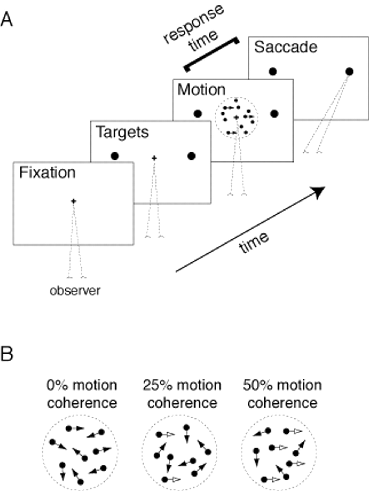
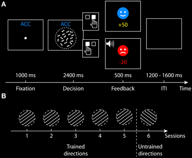

```{r}
#| echo: false
library(ggplot2)
library(dplyr)
```

## Why should we use EAM in visual perception?

## Why should we use EAM in visual perception?

- accuracy

## Why should we use EAM in visual perception?

- accuracy

- RT

## Why should we use EAM in visual perception?

::::: columns
::: {.column width="50%"}

- accuracy

- RT

> Can we put them together?

:::
::: {.column width="50%"}

{width="400" height="400"}
:::
:::::

## Why should we use EAM in visual perception?

::::: columns
::: {.column width="50%"}

- accuracy

- RT

> Can we put them together?

<br/>

Speed-accuracy trade-off
:::
::: {.column width="50%"}

{width="400" height="400"}
:::
:::::

# Some examples

## The effect of stimulus strength on the speed and accuracy of a perceptual decision {.small-text}

<br/>

Which is the relation between **RT** and **Accuracy** measures?

<br/>

<div style="position: absolute; bottom: 10px; width: 100%; text-align: center; font-size: 0.8em;">
[Palmer et al., 2005](https://doi.org/10.1167/5.5.1){target="_blank"}
</div>

## The effect of stimulus strength on the speed and accuracy of a perceptual decision {.small-text}

<br/>

Which is the relation between **RT** and **Accuracy** measures?

<br/>

**Accuracy** → Signal Detection Theory (SDT)  
→ **Psychometric function**: d' as a function of stimulus strength

<div style="position: absolute; bottom: 10px; width: 100%; text-align: center; font-size: 0.8em;">
[Palmer et al., 2005](https://doi.org/10.1167/5.5.1){target="_blank"}
</div>

## The effect of stimulus strength on the speed and accuracy of a perceptual decision {.small-text}

<br/>

Which is the relation between **RT** and **Accuracy** measures?

<br/>

**Accuracy** → Signal Detection Theory (SDT)  
→ **Psychometric function**: d' as a function of stimulus strength

**RT** → **Chronometric function**: mean RT as a function of stimulus strength

<div style="position: absolute; bottom: 10px; width: 100%; text-align: center; font-size: 0.8em;">
[Palmer et al., 2005](https://doi.org/10.1167/5.5.1){target="_blank"}
</div>

## The effect of stimulus strength on the speed and accuracy of a perceptual decision {.small-text}

<br/>

Which is the relation between **RT** and **Accuracy** measures?

<br/>

**Accuracy** → Signal Detection Theory (SDT)  
→ **Psychometric function**: d' as a function of stimulus strength

**RT** → **Chronometric function**: mean RT as a function of stimulus strength

<br/>

**RT and Accuracy depend on the difficulty of a perceptual judgment.**

<div style="position: absolute; bottom: 10px; width: 100%; text-align: center; font-size: 0.8em;">
[Palmer et al., 2005](https://doi.org/10.1167/5.5.1){target="_blank"}
</div>

## Coupling of RT and Accuracy {.small-text}

<br/>

**DDM produces a fixed relationship between RT and accuracy for a given stimulus strength**

<br/>

- SDT + separate RT modeling cannot capture this coupling  

- RT modeling alone ignores accuracy constraints

- DDM **integrates both**, predicting how changes in stimulus strength shift RT and accuracy together

- Single generative framework → fewer parameters, more precise predictions

<div style="position: absolute; bottom: 10px; width: 100%; text-align: center; font-size: 0.8em;">
[Palmer et al., 2005](https://doi.org/10.1167/5.5.1){target="_blank"}
</div>

---

::::: columns
::: {.column width="40%"}
{width=450 height=550}
:::

::: {.column .small-text width="60%"}

<br/>

**Drift rate reflects sensitivity to stimulus strength**:

<br/>

- Increases with stronger stimuli

<br/>

- Robust across:
  <div style="font-size:0.75em; margin-left: 1em;">
  - Two **response modalities** (saccades and key pressing)  
  - Three different **stimulus judgments** (motion discrimination, contrast detection, contrast discrimination)  
  </div>

:::
:::::

<div style="position: absolute; bottom: 10px; width: 100%; text-align: center; font-size:0.64em;">
[Palmer et al., 2005](https://doi.org/10.1167/5.5.1){target="_blank"}
</div>

---

::::: columns
::: {.column width="40%"}
{width=450 height=550}
:::

::: {.column .small-text width="60%"}

<br/>

**Boundary separation reflects the speed-accuracy trade-off**:

<br/>

- Larger boundaries produce slower but more accurate responses

<br/>

- Variations in instructions or conditions that prioritize speed versus accuracy are captured primarily by adjustments in boundary, without altering drift rate
  
:::
:::::
<div style="position: absolute; bottom: 10px; width: 100%; text-align: center; font-size: 0.64em;">
[Palmer et al., 2005](https://doi.org/10.1167/5.5.1){target="_blank"}
</div>
  
## Dissociable mechanisms of speed-accuracy tradeoff during visual perceptual learning are revealed by a hierarchical drift-diffusion model {.small-text}

<br/>

Drift-diffusion model to examine:

- the speed-accuracy trad-eoff
- perceptual learning effect

during learning of a coherent motion discrimination task across multiple training sessions.

<div style="position: absolute; bottom: 10px; width: 100%; text-align: center; font-size: 0.8em;">
[Zhang et al., 2014](https://doi.org/10.3389/fnins.2014.00069){target="_blank"}
</div>

---

::::: columns
::: {.column width="50%"}

{width=500 height=500}
:::
::: {.column width="50%"}

**Boundary**:

- Larger under accuracy vs. speed emphasis
- Decreases with training

**Drift Rate**:

- Not significantly affected by speed-accuracy trade-off
- Increases with training
:::
:::::

<div style="position: absolute; bottom: 10px; width: 100%; text-align: center; font-size: 0.64em;">
[Zhang et al., 2014](https://doi.org/10.3389/fnins.2014.00069){target="_blank"}
</div>

## Enhancing change perception through object-based attention {.small-text}

<br/>

In a change perception paradigm:

- accuracy

- RT

<br/>

Is change perception facilitated by object-based attention?

<div style="position: absolute; bottom: 10px; width: 100%; text-align: center; font-size: 0.8em;">
[Xie & Fu, 2025](https://doi.org/10.3758/s13414-025-03086-7){target="_blank"}
</div>

---

{height=480}

**Drift rate** consistently higher for within vs. between conditions → faster evidence accumulation.

<div style="position: absolute; bottom: 10px; width: 100%; text-align: center; font-size: 0.64em;">
[Xie & Fu, 2025](https://doi.org/10.3758/s13414-025-03086-7){target="_blank"}
</div>

# The Experiment

## Stimuli

<br/>

Manipulate difficulty to modulate:

-   Drift rate

-   Error rates (target: **5–35%**)

Avoid:

-   **Floor effects** → guessing

-   **Ceiling effects** → no errors to fit

<div style="position: absolute; bottom: 10px; width: 100%; text-align: center; font-size: 0.8em;">
[Boag et al. 2025](https://doi.org/10.1177/25152459251336127){target="_blank"}
</div>

## Stimuli

<br/>

2 x 2 x 2 design:

- 2 **gap sizes** (small vs large)  
- 2 **conditions** (congruent vs incongruent)  
- 2 peripheral orientations (left vs right)

---

{width="1200" height="675"}

---

{width="1200" height="675"}

---

{width="1200" height="675"}

---

{width="1200" height="675"}

## Response modality

<br/>

EAMs assume the response begins **after the decision ends**.

Best modalities:

-   **Manual keypresses**

-   **Saccades**

Avoid imprecise, slow, or delayed responses.

<div style="position: absolute; bottom: 10px; width: 100%; text-align: center; font-size: 0.8em;">
[Boag et al. 2025](https://doi.org/10.1177/25152459251336127){target="_blank"}
</div>

## Trial structure and event timing

EAM tasks follow a structured sequence of events:

1.  **Cue** (optional)

2.  **Fixation**

3.  **Stimulus onset**

4.  **Response window**

5.  **Intertrial interval**

Each component affects the integrity of evidence accumulation.

<div style="position: absolute; bottom: 10px; width: 100%; text-align: center; font-size: 0.8em;">
[Boag et al. 2025](https://doi.org/10.1177/25152459251336127){target="_blank"}
</div>

## Procedure

<br/>

{width="300"}

<br/>

Task: targets (peripheral) lines **orientation judgement** left vs right.

## Cue

<br/>

Optional cue presented **before** stimulus onset.

<br/>

Informs participants **how** to respond (e.g., emphasis on speed or accuracy).

<div style="position: absolute; bottom: 10px; width: 100%; text-align: center; font-size: 0.8em;">
[Boag et al. 2025](https://doi.org/10.1177/25152459251336127){target="_blank"}
</div>

## Cue

<br/>

May set cognitive control parameters:

-   **Thresholds**
-   **Biases**


Can direct **gaze or attention** to a spatial location.

> Must occur **before** evidence accumulation begins.

<div style="position: absolute; bottom: 10px; width: 100%; text-align: center; font-size: 0.8em;">
[Boag et al. 2025](https://doi.org/10.1177/25152459251336127){target="_blank"}
</div>

## Fixation interval

<br/>

-   Ensures eyes and attention are centered.
-   Allows previous trial’s processes to return to **baseline**.
-   Reduces overlap across trials.

<br/>

:bulb: **Best practice:** Use **variable durations**

<div style="position: absolute; bottom: 10px; width: 100%; text-align: center; font-size: 0.8em;">
[Boag et al. 2025](https://doi.org/10.1177/25152459251336127){target="_blank"}
</div>

## Stimulus onset

<br/>

-   Marks the **start** of evidence accumulation.
-   Assumes **constant signal strength** from onset to response.

<br/>

> Any variability or delay in onset weakens the assumption of continuous accumulation.

<div style="position: absolute; bottom: 10px; width: 100%; text-align: center; font-size: 0.8em;">
[Boag et al. 2025](https://doi.org/10.1177/25152459251336127){target="_blank"}
</div>

## Response window

<br/>

::::: columns
::: {.column width="50%"}
Starts with stimulus onset.

Ends with:

-   A **response**
-   Or a **deadline**

::: 

::: {.column width="50%"}
:bulb: Calibrate response window:

Long enough to allow natural responding

Short enough to avoid strategy shifts

::: 
:::::

Typical EAM use: **mean RT \< 1.5 s**

<div style="position: absolute; bottom: 10px; width: 100%; text-align: center; font-size: 0.8em;">
[Boag et al. 2025](https://doi.org/10.1177/25152459251336127){target="_blank"}
</div>

## Intertrial interval

<br/>

-   Allow participant to **reset**

<br/>

-   Prevent **proactive interference**

<br/>

-   Avoid **sequential effects**

<div style="position: absolute; bottom: 10px; width: 100%; text-align: center; font-size: 0.8em;">
[Boag et al. 2025](https://doi.org/10.1177/25152459251336127){target="_blank"}
</div>

## Collecting data

-   Participant ID

-   Condition

-   Stimulus presented

-   Response submitted

-   RT

-   Session/trial number

-   Event timings: cue, stimulus, response, feedback, intertrial interval

<div style="position: absolute; bottom: 10px; width: 100%; text-align: center; font-size: 0.8em;">
[Boag et al. 2025](https://doi.org/10.1177/25152459251336127){target="_blank"}
</div>

## Hypotheses

<br/>

<div style="font-size:0.85em;">
1. Smaller gap enhances central interference (same-feature suppression)  
</div>

  Gap effect: **small gap** higher accuracy but slower RT (**higher threshold**)

<br/>

<div style="font-size:0.85em;">
2. Incongruent lines enhance central-peripheral segmentation  
</div>
   
  Congruency effect: **incongruent conditions** have higher accuracy and faster RT (**higher drift rate**)
  
# Now your turn!


